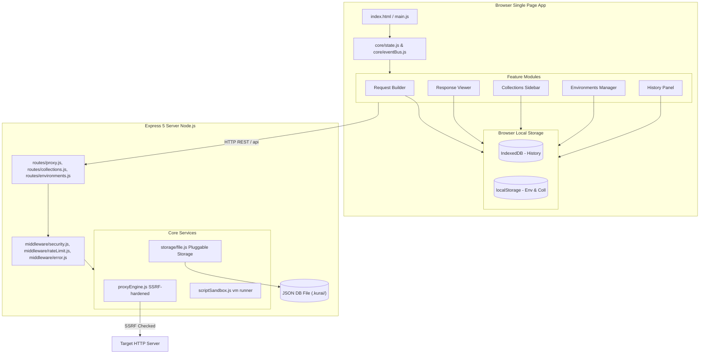

# Kurai ⚡

**A modern, zero-install, browser-based API client for developers.** Think Postman — but open, lightweight, self-hostable, offline-first, and running entirely from a single Node.js process.


---

## 📖 Table of Contents

1. [Project Overview](#-project-overview)
2. [Key Features](#%EF%B8%8F-key-features)
3. [Technologies Used](#-technologies-used)
4. [Folder Structure](#-folder-structure)
5. [Application Workflow](#%EF%B8%8F-application-workflow)
6. [Installation & Setup](#-installation--setup)
7. [API Reference](#-api-reference)
8. [Scripting & Test Runner API](#-scripting--test-runner-api)
9. [Security Hardening Suite](#-security-hardening-suite)
10. [Comparison Matrix: Kurai vs. Postman](#-comparison-matrix-kurai-vs-postman)
11. [License](#-license)

---

## 🌟 Project Overview

**Kurai (暗い)** is a premium, open-source, and self-hostable alternative to heavyweight API clients like Postman. It is designed to run directly inside any standard web browser, bypassing CORS restrictions through an aggressively sandboxed, SSRF-hardened local Node.js proxy server. 

### Why Kurai Exists

Most modern API development clients have moved from developer utility tools to massive enterprise platforms, forcing user accounts, auto-syncing sensitive credentials and API specs to proprietary clouds, and consuming hundreds of megabytes of RAM under heavy Electron wrappers. 

Kurai returns to the roots of developer tooling:
*   **Privacy-First:** Zero telemetry. Zero accounts. Your data never leaves your disk or your own hosting environment.
*   **Zero Install:** Run a single command and launch in your browser. No 500MB+ desktop download required.
*   **Production-Ready:** Pre-configured for Docker, micro-environments, and team collaborations. Swappable database backend with an interface seam already in place.
*   **Hardened Security:** Built-in safeguards protect against Server-Side Request Forgery (SSRF) and malicious test scripts.

---

## 🕹️ Key Features

### 1. Request Builder
*   **Complete HTTP Suite:** Supports GET, POST, PUT, PATCH, DELETE, HEAD, OPTIONS, and the modern HTTP **`QUERY`** method (safe, idempotent GET-with-body).
*   **Live Params Sync:** Real-time bi-directional binding between URL query strings and query params inputs. Typing a parameter dynamically mutates the URL, and editing the URL instantly populates parameter rows.
*   **Body & Header Editors:** Supports standard raw text, application/json, multipart/form-data, and x-www-form-urlencoded payloads.
*   **Auth Assistants:** Seamless helpers for Bearer tokens, Basic Auth (username/password), and customizable API Keys (injected in header or query params).

### 2. Sandbox Test Runner
*   **Node.js `vm` Isolation:** User-written test scripts execute in an isolated sandbox. It runs with zero filesystem, network, or process access, and enforces a strict 1-second timeout.
*   **BDD Assertions:** Assert on statuses, timings, sizes, headers, and JSON body elements with `kurai.test()` and `kurai.expect()`.
*   **Variable Chaining:** Extract response variables and save them to the active environment dynamically (e.g., retrieving an authorization token from a `/login` response and setting it for subsequent API calls).

### 3. Response Viewer
*   **Rich Display Modes:** View raw, formatted (syntax-highlighted JSON), and HTML responses (inside a sandboxed, script-disabled iframe).
*   **Visualize Tables:** Automatically render JSON arrays as interactive, sortable data tables.
*   **Metric Badges:** Instant readouts for HTTP status codes (color-coded), response times, and payload sizes.
*   **Tabbed Details:** Distinct panels for HTTP headers, parsed cookies, and sandboxed test execution summaries.

### 4. Environments & Variables
*   **Dynamic Templating:** Replace URLs, headers, bodies, or secrets with `{{variable}}` syntax, resolved dynamically at request time.
*   **Manager Interface:** Easily create, rename, or delete environment profiles (e.g., `Development`, `Staging`, `Production`), with granular key-value activation toggles.

### 5. Collections & History
*   **Organized Sidebar:** Group queries into hierarchical, named folders with request-count badges.
*   **Snapshot Backups:** Saving a request captures its active configuration state without mutating original collections.
*   **Bounded History:** Automatically logs the last 50 queries in a searchable history sidebar panel, persisting them client-side in IndexedDB.

---

## 🛠️ Technologies Used

Kurai uses a modern, lightweight, and auditable tech stack with minimal external dependencies in its security-critical paths.

### Frontend (Client-Side)
*   **HTML5 Semantic Markup:** Structured for accessibility (ARIA attributes) and tabbed navigation.
*   **Vanilla JS (ES Modules):** Completely framework-free client codebase using native ES Modules (`import`/`export`), preventing build step overhead.
*   **CSS Custom Properties:** Flexible variables-driven design supporting dark/light mode toggles and resizable grid layouts.
*   **IndexedDB & LocalStorage:** Bounded caching (history, session state) with asynchronous fallback capabilities.

### Backend (Server-Side)
*   **Express 5 (ESM):** Serving client files and handling core proxy routes.
*   **Node.js `vm` Module:** Sandboxed JavaScript compilation and execution for post-request scripts.
*   **Vanilla Security Engines:** Hand-rolled middleware for Content Security Policies (CSP), rate limiting, request validation, and DNS resolution validation.
*   **JSON Disk Storage:** Atomic, file-based, zero-config JSON persistence.

---

## 📁 Folder Structure

The repository follows a clean separation of concerns and features-slice architecture layout:

```
Kurai/
├── cli/
│   └── kurai.js                  # CLI launcher (npx kurai)
├── client/                       # Frontend single-page app
│   ├── core/
│   │   ├── eventBus.js           # Global pub/sub event router
│   │   └── state.js              # Central reactive client state
│   ├── features/                 # Feature-specific controllers & views
│   │   ├── collections/          # Collections sidebar folder & requests
│   │   ├── environment/          # Environment variables & manager
│   │   ├── history/              # Request history cache
│   │   ├── layout/               # Window resizer & drawer settings
│   │   ├── request/              # HTTP methods, body formats & tests tab
│   │   └── response/             # Response view panels & visualizers
│   ├── network/
│   │   └── client.js             # API wrapper for server proxy communication
│   ├── storage/
│   │   └── db.js                 # IndexedDB history management
│   ├── styles/                   # Modular design system CSS
│   │   ├── reset.css             # CSS baseline resets
│   │   ├── tokens.css            # Color palettes & design systems variables
│   │   ├── components.css        # Reusable buttons, inputs & forms
│   │   ├── layout.css            # Responsive split panes grid layout
│   │   └── themes/               # Dark & Light variables
│   ├── index.html                # Application DOM entry-point
│   └── main.js                   # Application bootstrap script
├── server/                       # Express Node.js Server
│   ├── config.js                 # App configuration & env loader
│   ├── index.js                  # Express application listener entry
│   ├── middleware/               # HTTP security, rate-limiting & logging
│   │   ├── error.js              # Catch-all Express error handling
│   │   ├── rateLimit.js          # Hand-rolled sliding window rate limiter
│   │   ├── security.js           # CSP, HSTS, CORS & hygiene headers
│   │   └── validate.js           # Joi-free lightweight payload validator
│   ├── routes/                   # Routing boundaries
│   │   ├── collections.js        # Collections persistence API
│   │   ├── environments.js       # Environments variables API
│   │   ├── health.js             # Liveness checks
│   │   ├── history.js            # Transient queries API
│   │   └── proxy.js              # Main CORS proxy entry
│   ├── services/                 # Underlying proxy logic
│   │   ├── proxyEngine.js        # SSRF blocker fetch engine
│   │   ├── scriptSandbox.js      # vm-sandbox executor
│   │   └── storageSelector.js    # Pluggable storage router
│   └── storage/
│       └── file.js               # Local atomic JSON files adapter
├── docker/                       # Docker deployment configs
│   ├── Dockerfile                # Production multi-stage Docker build
│   └── docker-compose.yml        # Orchestration setup
├── docs/                         # Extended markdown guides
│   ├── ARCHITECTURE.md           # Architecture details
│   ├── FEATURES.md               # Detailed features comparison
│   └── images/
│       └── screenshot.jpg        # Product visual demo
└── test-server/                  # Local mock target API (Development)
    ├── server.js                 # Mock HTTP server
    └── README.md                 # Mock server test runner walkthrough
```

---

## 🔄 Application Workflow

### Component Architecture Data Flow

The diagram below outlines the core layout of Kurai's frontend feature modules and their integration with the backend storage and security proxy services:



### Request Execution Lifecycle

The following sequence diagram tracks the flow of an API test from the browser interface, passing through security guards, communicating with external upstream servers, and executing test assertions inside the backend script sandbox:

```mermaid
sequenceDiagram
    autonumber
    actor Dev as Developer (Browser)
    participant UI as Kurai Web UI
    participant Storage as Browser Storage (IndexedDB/Local)
    participant Server as Express Server (Proxy)
    participant Sandbox as Node.js VM Sandbox
    participant Upstream as Target API Server

    Dev->>UI: Input URL & Method (e.g. GET /users)
    Dev->>UI: Configure Headers, Params & Test Script
    Dev->>UI: Press 'Send' (or Ctrl+Enter)
    UI->>Storage: Save Request to History
    UI->>Server: Send POST /api/proxy (Envelope payload)
    
    rect rgb(20, 20, 25)
        Note over Server: Security Engine Active
        Server->>Server: Resolve target DNS (A & AAAA records)
        Server->>Server: Validate against SSRF Blocklist (IPv4 & IPv6 private/loopback)
    end
    
    Server->>Upstream: Forward Clean Request
    Upstream-->>Server: Return Upstream HTTP Response
    
    rect rgb(20, 20, 25)
        Note over Server: Execute Script in Isolated VM Sandbox
        Server->>Sandbox: Spin up sandboxed VM (no process, no net, 1s timeout)
        Server->>Sandbox: Pass response & active env variables
        Sandbox->>Sandbox: Execute tests & variable setters (kurai.variables.set)
        Sandbox-->>Server: Return test results & modified variables
    end
    
    Server-->>UI: Return HTTP envelope (Response + Tests + Env variables)
    UI->>Storage: Merge & persist modified environment variables
    UI->>Dev: Render Status, Pretty JSON Body, Headers, Cookies, Table Visualize & Test Results
```



---

## 🚀 Installation & Setup

### Prerequisites
*   Node.js (v18.x or higher)
*   npm (v9.x or higher)

### Quick Start (Local Run)

1.  **Clone the repository:**
    ```bash
    git clone https://github.com/adarsh-singh106/Kurai.git && cd Kurai
    ```
2.  **Install dependencies:**
    ```bash
    npm install
    ```
3.  **Set up configuration environment:**
    ```bash
    cp .env.example .env
    ```
    *(Defaults are pre-configured for instant local running)*
4.  **Launch the development server:**
    ```bash
    npm run dev
    ```
    This starts the development server on **`http://localhost:3000`** with nodemon auto-reload.

### Running with CLI Launcher
You can also run the CLI script directly using Node:
```bash
node cli/kurai.js --port 8080
```
*   `--port <port>`: Change the running port (default `3000`).
*   `--no-open`: Run headlessly (disables auto-opening the browser tab).

---

### Running the Demo API (Integration Testing)

To fully explore Kurai's feature suite (CORS proxy, environment templates, test scripting), start the built-in mock server:

1.  **Launch the Mock API:**
    ```bash
    npm run demo
    ```
    This launches a target endpoint server at `http://127.0.0.1:5100`.
2.  **Launch Kurai permitting local API routing:**
    ```bash
    # Set proxy permissions to allow private/localhost loops
    $env:PROXY_ALLOW_PRIVATE_IPS="true"; npm run dev   # Windows PowerShell
    # OR
    PROXY_ALLOW_PRIVATE_IPS=true npm run dev           # macOS / Linux
    ```
3.  For a comprehensive set of test cases to try, read the [test-server/README.md](test-server/README.md) walkthrough.

---

### Docker Deployment

To self-host Kurai inside a Docker container:

```bash
# Build and run using Docker Compose
docker compose -f docker/docker-compose.yml up --build
```
The application will map and run on `http://localhost:3000`.

---

## 🔌 API Reference

All proxy communications and database modifications route through standard Express handlers returning a uniform envelope structure:

### Envelope Success Format
```json
{
  "ok": true,
  "data": { ... }
}
```

### Envelope Failure Format
```json
{
  "ok": false,
  "error": {
    "code": "SSRF_BLOCKED",
    "message": "Accessing private or loopback IP ranges is forbidden."
  }
}
```

---

### Endpoints Directory

| Method | Endpoint | Description | Payload Schema |
| :--- | :--- | :--- | :--- |
| **POST** | `/api/proxy` | Resolves, sanitizes, forwards HTTP requests, runs vm tests. | See Proxy Payload below |
| **GET** | `/api/collections` | Fetch list of saved collection folders. | None |
| **POST** | `/api/collections` | Save new collection folder. | `{ "name": "Auth API" }` |
| **PUT** | `/api/collections/:id` | Update collection metadata/items. | Full JSON Collection |
| **DELETE** | `/api/collections/:id` | Evict collection from storage. | None |
| **GET** | `/api/environments` | Retrieve all variables files. | None |
| **POST** | `/api/environments` | Save new variables environment. | `{ "name": "Staging" }` |
| **PUT** | `/api/environments/:id` | Update variables and credentials. | Full JSON Environment |
| **DELETE** | `/api/environments/:id` | Delete variables environment. | None |
| **GET** | `/health` | Kubernetes / Docker liveness probe. | None |

---

### `/api/proxy` Payload Schema

```json
{
  "url": "https://api.example.com/v1/users",
  "method": "POST",
  "headers": {
    "Content-Type": "application/json",
    "Authorization": "Bearer {{jwtToken}}"
  },
  "body": "{\"username\": \"test-user\"}",
  "script": "kurai.test('status check', () => kurai.expect(response.status).toBe(201));",
  "variables": {
    "jwtToken": "token-xyz-123"
  }
}
```

#### Proxy Error Codes
If the proxy cannot resolve or process the connection, it returns `ok: false` with one of the following structured error codes:
*   `INVALID_URL`: The URL syntax is malformed.
*   `INVALID_PROTOCOL`: The protocol is not `http:` or `https:`.
*   `SSRF_BLOCKED`: The domain resolved to a private/loopback/cloud metadata IP range.
*   `RESPONSE_TOO_LARGE`: Response body exceeded the size limit (default 50MB).
*   `UPSTREAM_UNREACHABLE`: The endpoint DNS could not resolve or returned a connection error.
*   `TOO_MANY_REDIRECTS`: The endpoint redirected more than 5 times.
*   `UPSTREAM_TIMEOUT`: The server did not respond within the time limit (default 30 seconds).

---

## 🧪 Scripting & Test Runner API

Scripts in the **Tests** tab execute server-side in a virtual machine sandbox.

### Global Sandbox Objects

*   `response`: Representation of the upstream HTTP response:
    ```js
    {
      status: 200,
      statusText: "OK",
      headers: { "content-type": "application/json" },
      body: '{"status":"active"}', // Raw body string
      json: { status: "active" },  // Pre-parsed object (null if not JSON)
      time: 145,                   // Response duration in ms
      size: 432                    // Response size in bytes
    }
    ```
*   `kurai.test(name, assertionFn)`: Registers a test case. Throwing an error inside the function marks it as failed.
*   `kurai.expect(actualValue)`: Expect object asserting values. Supports:
    *   `.toBe(expected)`: Check strict equality (`===`).
    *   `.toEqual(expected)`: Perform deep-object checking.
    *   `.toContain(substringOrItem)`: Check array containment or substring existence.
    *   `.toBeLessThan(num)` / `.toBeGreaterThan(num)`: Numerical ranges.
*   `kurai.variables.get(key)` / `kurai.variables.set(key, value)`: Read or write variables. Sets will be merged back into the active environment in the browser.

### Scripting Example
```js
kurai.test("HTTP Status is 200 OK", () => {
  kurai.expect(response.status).toBe(200);
});

kurai.test("Verify fast latency", () => {
  kurai.expect(response.time).toBeLessThan(350);
});

kurai.test("Verify response body contents", () => {
  kurai.expect(response.json.active).toBe(true);
});

// Save login JWT for future collection queries
if (response.status === 200 && response.json.token) {
  kurai.variables.set("jwtToken", response.json.token);
}
```

---

## 🛡️ Security Hardening Suite

Kurai treats security as a fundamental engineering requirement rather than a secondary feature.

1.  **Multi-Hop DNS Validation:** Standard proxies only inspect the initial request URL. Kurai overrides redirect following, resolving hostnames to DNS A/AAAA records on **every redirect hop** to prevent DNS rebinding attacks from routing traffic back to local interfaces.
2.  **IP Range Blocklists:** Blocks local IP loops (`127.0.0.0/8`, `::1`), private networks (`10.0.0.0/8`, `172.16.0.0/12`, `192.168.0.0/16`), unique local IPv6 (`fc00::/7`), and cloud instance metadata endpoints (`169.254.169.254`).
3.  **Authorization Stripping:** The proxy strips authorization and cookies headers when redirected across origins.
4.  **Zero-Inlined Script Content Security Policy (CSP):** The front-end disables inline script executions (`unsafe-inline`) to completely eliminate Cross-Site Scripting (XSS) risks.
5.  **Sanitized Response Visualizer:** Response viewer uses absolute sanitization and escaping for JSON/HTML rendering, ensuring malicious response payloads cannot execute scripts or steal active session tokens.

---

## 📊 Comparison Matrix: Kurai vs. Postman

| Feature Component | Typical Desktop API Clients (e.g. Postman) | Kurai ⚡ |
| :--- | :--- | :--- |
| **Privacy & Syncing** | Forced cloud syncs; sensitive developer API credentials stored on vendor servers. | **Zero Cloud Sync.** Data lives on local storage (IndexedDB) or your own controlled disk database. |
| **Account Required** | Yes. Often forces login screens even for basic local requests. | **Never.** No accounts, no sign-ins, no marketing paywalls. |
| **Binary Weight** | Heavy 500MB+ desktop Electron instances running background updaters. | **Lightweight.** Single Express service + Vanilla HTML/CSS/JS web interface. |
| **Offline Performance** | Degraded capabilities. Scratch Pad mode disabled or restricted. | **Fully Functional Offline.** Native local performance without remote reliance. |
| **Self-Hosting Options** | Enterprise licensing restrictions. | **Free & Self-Hostable.** Packaged via Docker under the ISC open license. |
| **Auditable Security** | Closed-source proxies/agents. | **Open & Auditable.** Hand-rolled security logic with minimal dependencies in critical paths. |

---

## 📄 License

Kurai is open-source software licensed under the [ISC License](LICENSE).
